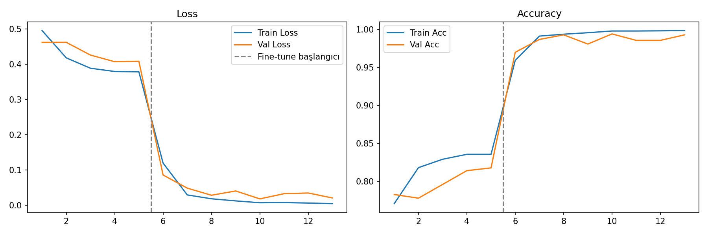
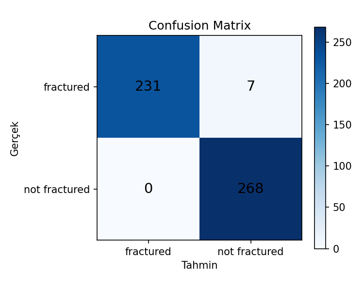

# 🦴 Bone Fracture Detection

EfficientNet-B0 tabanlı transfer learning modeli ile X-ray görüntülerinden kemik kırığı tespiti.

## 🎯 Sonuçlar

| Metrik | Değer |
|--------|-------|
| Test Accuracy | %99 |
| ROC-AUC | 0.9987 |
| Precision (fractured) | 1.00 |
| Recall (fractured) | 0.97 |
| F1-Score | 0.99 |




## 🚀 Demo

👉 [Hugging Face Spaces Demo](https://huggingface.co/spaces/pelinbingl/bone-fracture-detection)

## 📁 Dataset

[Bone Fracture Multi-Region X-ray — Kaggle](https://www.kaggle.com/datasets/bmadushanirodrigo/fracture-multi-region-x-ray-data)

| Split | Görüntü Sayısı |
|-------|---------------|
| Train | 9,246 |
| Val | 829 |
| Test | 506 |
| **Toplam** | **10,581** |

## 🏗️ Model Mimarisi

- **Backbone:** EfficientNet-B0 (ImageNet pretrained)
- **Strateji:** 2 aşamalı transfer learning
  - Aşama 1: Frozen backbone, sadece classifier eğitimi (5 epoch)
  - Aşama 2: Full fine-tune (8 epoch)
- **Optimizer:** AdamW
- **Scheduler:** CosineAnnealingLR
- **Loss:** CrossEntropyLoss

## ⚙️ Kurulum

```bash
git clone https://github.com/pelinbingl/Bone_Fracture_Detection
cd Bone_Fracture_Detection
pip install torch torchvision gradio scikit-learn matplotlib Pillow
```

### Eğitim
```bash
python train.py
```

### Demo
```bash
python app.py
```

## 🔗 İlgili Proje

Bu proje, **Bone Region Identification** ile birlikte uçtan uca X-ray analiz pipeline'ı oluşturur:

```
X-Ray Görüntüsü
      ↓
Bone Region Identification  →  Hangi kemik bölgesi?
      ↓
Bone Fracture Detection     →  Kırık var mı?
```

👉 [Bone Region Identification](https://github.com/pelinbingl/Bone_Region_Identification)

## 👩‍💻 Geliştirici

**Pelin Bingöl**
[LinkedIn](https://linkedin.com/in/pelin-bingöl) • [GitHub](https://github.com/pelinbingl)
